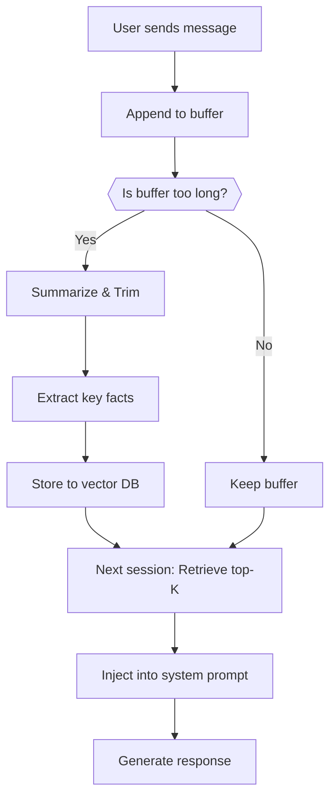

# 🧠 Conversational Memory for LLMs

**Date Created:** 2025-07-10

## Overview
A strategy to implement **short-term** and **long-term** memory in large language models (LLMs) using LangChain / LangGraph. Based on insights from Supermemory.ai's guide.

---

## 🟢 Short-Term Memory (Session-Based)
- **Buffering**: Retain last _k_ interactions.
- **Summarization**: Compress older dialogue into summary.
- **Trimming**: Cut off oldest tokens if over limit.

### 🛠️ Tools
- `ConversationBufferMemory`
- `ConversationSummaryBufferMemory`
- Token counter utilities from LangChain.

---

## 🔵 Long-Term Memory (Persistent)
- **Fact extraction**: Use LLM to generate summary key facts.
- **Vector storage**: Save facts to Chroma, Pinecone, or FAISS.
- **Retrieval**: Pull contextually relevant facts per user/session.

### 🛠️ Tools
- `Chroma` or other vector DB.
- `StateGraph` and `MemorySaver` from LangGraph.
- JSON / SQLite fallback for local dev.

---

## ✅ Workflow Outline

---

## 📌 Best Practices
- Use namespaces per user or project in your DB.
- Regularly compress long-term memory to save cost and increase precision.
- Optionally leverage tools like [Supermemory.ai](https://supermemory.ai) for managed pipelines.

---

## 📚 Sources
- [Supermemory Guide](https://supermemory.ai/blog/how-to-add-conversational-memory-to-llms-using-langchain/)
- [LangChain Docs](https://docs.langchain.com/)
- [LangGraph](https://www.langchain.dev/langgraph/)

---

*Crafted for your reflective AI vault. Persist gently, recall precisely.*
