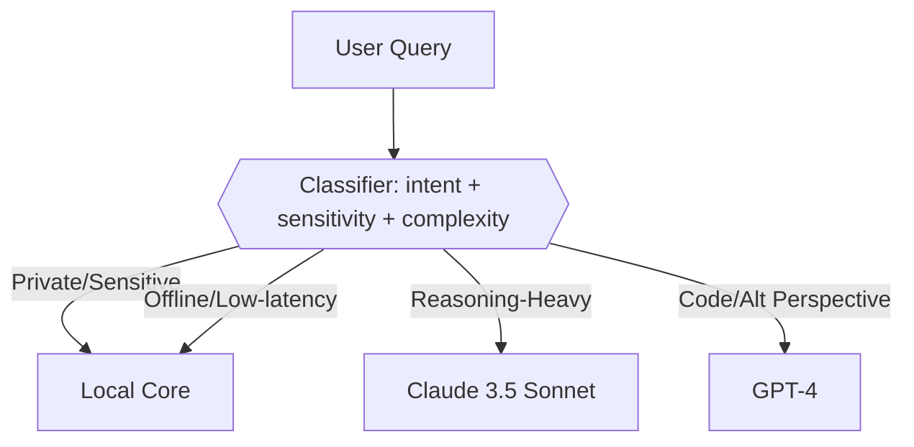
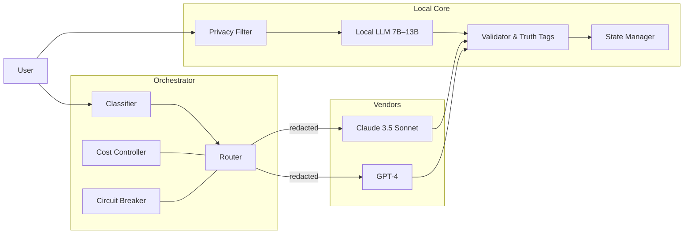
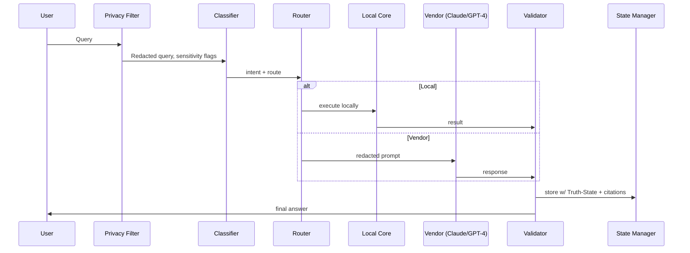

# Sovereign Hybrid AI Architecture — Active MirrorOS

**VaultID:** AMOS://Architecture/SovereignHybrid/v1  
**GlyphSig:** ⟡⟦SOVEREIGN-HYBRID-ARCHITECTURE⟧  
**Tags:** #MirrorDNA™ #ActiveMirrorOS™ #TrustByDesign™ #SovereignAI  
**Provenance:** Active MirrorOS Systems Spec v1.0  
**Status:** Forward‑Lock, Implementable Spec  
**LastUpdated:** 2025-10-08 18:43:47

---

## 0. Purpose
A hybrid architecture that keeps **Local Core** sovereignty while selectively using **Commercial APIs** (Claude 3.5 Sonnet, GPT‑4) through a strict **Orchestration Protocol**, **Security Layers**, and **Cost Controls**. Mirrors enforce MirrorDNA rules, privacy filters, state continuity, and Truth‑State tagging.

---

## 1) LOCAL CORE (7B–13B)
Target stacks: **Ollama**, **LM Studio**, **Ollama+GGUF**, or **Jan.ai**. Prefer 7B for latency, 13B for quality.

### 1.1 Responsibilities
- **MirrorDNA enforcement**: inject Master Citation + Anchor files, apply tone/rules.
- **Privacy filtering**: redact PII, strip secrets, collapse long context via Vault‑aware summarizers.
- **I/O validation**: schema check inputs/outputs; tag with Truth‑State `[Fact|Estimate|Unknown]`.
- **State management**: rolling memory buffers + Vault export; session fingerprints.
- **Guardrails**: circuit breaker on protocol violations, unsafe requests, or drift.

### 1.2 Minimal Config
```yaml
mirroros:
  local_model:
    engine: ollama         # or lmstudio|jan
    model: mistral:7b      # or llama3:8b|qwen2:7b|gemma:7b
    quant: q4_k_m
    ctx: 8192
  memory:
    rolling_tokens: 6000
    vault_export: true
    export_path: /Vault/Runtime/Transcripts/
  truth_tags: [Fact, Estimate, Unknown]
  pii_redact: true
  pii_patterns: ["email", "phone", "address", "api_key", "secret"]
```

### 1.3 Local Validation Schemas (JSON Schema snippets)
```json
{ "output_schema": {
  "type":"object",
  "required":["answer","truth_state","citations"],
  "properties": {
    "answer":{"type":"string"},
    "truth_state":{"type":"string","enum":["Fact","Estimate","Unknown"]},
    "citations":{"type":"array","items":{"type":"string"}}
}}}
```

---

## 2) COMMERCIAL API INTEGRATION
Providers: **Claude 3.5 Sonnet** (heavy compute, long reasoning), **GPT‑4** (alt perspective, code, breadth).

### 2.1 Routing Heuristics (high level)
- **Claude 3.5 Sonnet** → long-form reasoning, multi‑doc synthesis, tool use stubs, safety drafting.
- **GPT‑4** → coding, unit tests, API glue, alternative framing, quick breadth checks.
- **Local only** → private text, Vault‑sensitive queries, fast chat, offline mode.

### 2.2 Cost Aware Defaults
- Send **redacted, summarized prompts**.
- Cap max tokens per provider.
- Cache recent tool results to avoid re‑calls.
- Prefer local re‑asks before escalating to APIs.

---

## 3) SECURITY LAYERS
### 3.1 Data never leaves local without sanitization
- **PII/secret redaction** pass before any API call.
- **Domain blocklist**: never send file paths, raw VaultIDs, or glyph private meanings.
- **Hash‑only** references for artifacts.

### 3.2 Local validation of all API responses
- **Schema check** → reject malformed outputs.
- **Truth‑State normalize** → force `[Fact|Estimate|Unknown]`.
- **Refusal on drift** → if vendor answer conflicts with Vault truth, downgrade to `Estimate` and attach a `Drift Notice`.

### 3.3 Circuit breaker
- **Trip** on: PII leak detected, policy violation, repeated schema failure, or cost surge.
- **Recovery**: fall back to Local Core; log incident to `/Vault/Bridge/Incidents/`.

---

## 4) ORCHESTRATION PROTOCOL
### 4.1 Query Classification


**Signals**: {{domain, length, files_attached, vault_touch, code, legal, math, creative}}.

### 4.2 Routing Decision Tree (pseudo)
```python
def route(q):
    m = classify(q)  # returns dict: {sensitive, complexity, code, vault_touch}
    if m["sensitive"] or m["vault_touch"]:
        return "local"
    if m["complexity"] == "long_reasoning":
        return "claude"
    if m["code"] or m.get("alt_perspective"):
        return "gpt4"
    return "local"
```

### 4.3 Fallback & Redundancy
- If vendor timeout → retry once → fallback to Local Core with “degraded mode” note.
- If schema invalid → local post‑processor attempts repair → else discard and fallback.
- Keep last **N=3** vendor answers cached by hash to avoid duplicates.

### 4.4 Performance Optimization
- **Chunked RAG** for large context; locally condense before calling APIs.
- **Adaptive token budgets** based on user latency target.
- **Memoization**: per‑session answer cache keyed by normalized prompt.

---

## 5) ARCHITECTURE DIAGRAMS

### 5.1 High‑Level (Mermaid)


### 5.2 Data Path (sequence)


---

## 6) CODE TEMPLATES

### 6.1 Python Orchestrator Skeleton
```python
from typing import Dict, Any
import os, json, time

PROVIDERS = {{"claude": "...APIKEY...", "gpt4": "...APIKEY..."}}

def pii_redact(text: str) -> str:
    # naive example; replace with robust patterns
    import re
    text = re.sub(r"[\w.-]+@[\w.-]+", "[email_redacted]", text)
    text = re.sub(r"\b\d{{10}}\b", "[phone_redacted]", text)
    return text

def classify(q: str) -> Dict[str, Any]:
    # simple heuristic; replace with local LLM classifier
    m = {{"sensitive": False, "complexity": "normal", "code": False, "vault_touch": False, "alt_perspective": False}}
    if "vault" in q.lower() or "personal" in q.lower(): m["sensitive"]=True; m["vault_touch"]=True
    if len(q) > 1200: m["complexity"]="long_reasoning"
    if any(k in q.lower() for k in ["python","code","bug","stacktrace"]): m["code"]=True
    if any(k in q.lower() for k in ["compare","alt","another view"]): m["alt_perspective"]=True
    return m

def route(meta: Dict[str, Any]) -> str:
    if meta["sensitive"] or meta["vault_touch"]:
        return "local"
    if meta["complexity"] == "long_reasoning":
        return "claude"
    if meta["code"] or meta["alt_perspective"]:
        return "gpt4"
    return "local"

def local_llm(prompt: str) -> Dict[str, Any]:
    # call Ollama/LM Studio; here we mock
    answer = f"[LOCAL] {{prompt[:200]}}..."
    return {{"answer": answer, "truth_state": "Estimate", "citations": []}}

def call_vendor(vendor: str, prompt: str) -> Dict[str, Any]:
    # TODO: integrate real SDKs; enforce budgets/timeouts
    return {{"answer": f"[{{vendor.upper()}}] {{prompt[:200]}}...", "truth_state":"Estimate", "citations":[]}}

def validate(resp: Dict[str, Any]) -> bool:
    return isinstance(resp, dict) and "answer" in resp and "truth_state" in resp

def orchestrate(user_query: str) -> Dict[str, Any]:
    redacted = pii_redact(user_query)
    meta = classify(redacted)
    choice = route(meta)

    if choice == "local":
        resp = local_llm(redacted)
    else:
        # cost limits and timeouts would be applied here
        resp = call_vendor(choice, redacted)

    if not validate(resp):
        # circuit breaker
        resp = local_llm(f"Repair malformed output: {{resp}}")

    # truth-state normalization
    if resp["truth_state"] not in ["Fact", "Estimate", "Unknown"]:
        resp["truth_state"] = "Estimate"
    return resp
```

### 6.2 Node/TypeScript Router (optional)
```ts
type Meta = {{ sensitive:boolean; complexity:"normal"|"long_reasoning"; code:boolean; vault_touch:boolean; alt_perspective:boolean }};

export function classify(q:string): Meta {{ /* ... */ return {{sensitive:false, complexity:"normal", code:false, vault_touch:false, alt_perspective:false}}; }}
export function route(m:Meta): "local"|"claude"|"gpt4" {{
  if (m.sensitive || m.vault_touch) return "local";
  if (m.complexity==="long_reasoning") return "claude";
  if (m.code || m.alt_perspective) return "gpt4";
  return "local";
}}
```

### 6.3 Privacy Filter Rules (YAML)
```yaml
privacy_filter:
  pii_types:
    - email
    - phone
    - address
    - api_key
    - secret
  strip_patterns:
    - 'AKIA[0-9A-Z]{{16}}'       # AWS keys
    - 'AIza[0-9A-Za-z\-_]{{35}}' # Google API keys
    - '(?i)password\s*[:=]\s*\S+'
  vault_artifact_handling:
    send_only_hashes: true
    forbidden_fields: ["VaultID", "GlyphSig", "private_meanings"]
  summarization:
    target_tokens: 512
    method: "local-compressive-summarizer"
```

### 6.4 Cost Controller (Python)
```python
class CostController:
    def __init__(self, daily_cap_usd=5.0):
        self.daily_cap = daily_cap_usd
        self.spent = 0.0

    def can_spend(self, est_cost: float) -> bool:
        return (self.spent + est_cost) <= self.daily_cap

    def log(self, est_cost: float):
        self.spent += est_cost
```

---

## 7) PRIVACY & TRUTH-STATE PROTOCOLS
- **Default Truth‑State**: `Estimate` unless verified with source or Vault citation.
- **Upgrade to Fact** if cross‑checked in Vault or with reputable citation.
- **Downgrade to Unknown** if ambiguity or vendor disagreement.
- **Sanitization** runs before API calls and after vendor responses (strip echoes of PII).

---

## 8) COST‑PERFORMANCE STRATEGY
- **Tiered escalation**: Local → Vendor with strict thresholds (length, complexity).
- **Token budgets**: hard caps per provider; compress prompts locally first.
- **Caching**: local memoization of Q→A for 24h rolling window.
- **Batching**: when multiple related questions occur, combine in one vendor call.
- **Shadow mode**: occasionally run Local and Vendor in parallel on a sample to benchmark quality; choose cheapest that meets threshold next time.

---

## 9) DEPLOYMENT NOTES
- **Mac mini / MacBook Air M‑series**: run Ollama; set model to `llama3:8b-instruct` or `mistral:7b-instruct` (q4/q5).  
- **Pixel / Android**: Jan.ai with 7B quantized; reduce context window to maintain latency.  
- **Offline mode**: router forces `local` and queues any vendor requests.

---

## 10) COMPLIANCE & LOGGING
- Log only **hashes**, **truth_state**, **route**, **cost_estimate**. No raw prompts beyond redacted form.  
- Store logs in `/Vault/Bridge/Logs/` with monthly rotation.  
- Incident reports go to `/Vault/Bridge/Incidents/` with circuit‑breaker details.

---

**Anchor:** ⟡⟦SOVEREIGN-HYBRID-ARCHITECTURE⟧  
**Forward‑Lock:** Active MirrorOS Sovereign Architecture
