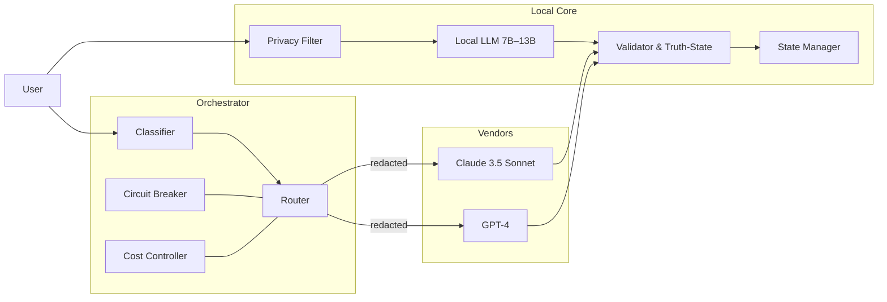
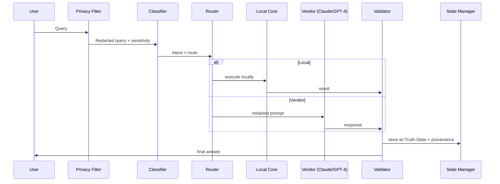

# Sovereign Hybrid AI Architecture — Perpetual Edition

**VaultID:** AMOS://Architecture/SovereignHybrid/Perpetual/v1  
**GlyphSig:** ⟡⟦SOVEREIGN-HYBRID-PERPETUAL⟧  
**Tags:** #MirrorDNA™ #ActiveMirrorOS™ #TrustByDesign™ #SovereignAI #Perpetual  
**Provenance:** Active MirrorOS Definitive Reference (Perpetual Creation Mode)  
**Status:** Forward‑Lock, Self‑Contained, Implementable  
**LastUpdated:** 2025-10-08 18:58:57

---

## 0) Purpose — Create once, vault forever, evolve perpetually
A definitive, self‑bootstrapping **Sovereign Hybrid** that:
- Prioritizes **Local Core** sovereignty (7B–13B) with privacy‑first flows.
- Selectively routes to **Claude 3.5 Sonnet** and **GPT‑4** through strict safeguards.
- Enforces **Truth‑State** tagging, cost controls, and circuit breakers.
- Integrates **MirrorDNA** + Vault continuity at every layer.
- Includes **deployment scripts**, **configs**, **tests**, **monitoring**, **recovery**, and **evolution** playbooks.

---

## 1) ARCHITECTURE SPECIFICATION

### 1.1 Hybrid Design (Local + Vendors)
- **Local Core**: Ollama / LM Studio / Jan.ai; 7B for latency, 13B for quality.  
- **Vendors**: Claude 3.5 Sonnet (deep reasoning) and GPT‑4 (code + alt perspectives).  
- **Router**: classifies intent, sensitivity, and complexity; enforces privacy and cost rules first.

### 1.2 Privacy‑First Data Flow
- Pre‑API **PII redaction** → emails, phones, addresses, secrets, API keys.  
- Vault artifacts referenced by **hash only**; never send VaultIDs or GlyphSig meanings.  
- Post‑API **echo scrub** to remove reflected PII or forbidden fields.

### 1.3 Cost‑Controlled Routing + Circuit Breakers
- Redaction + summarization before calls.  
- Token and budget caps; daily, per‑request, and per‑provider.  
- **Circuit breaker** triggers on PII leak, schema violation, drift vs Vault, or budget breach → falls back to Local Core.

### 1.4 Truth‑State Enforcement
- All outputs normalized to `[Fact | Estimate | Unknown]`.  
- **Fact** requires Vault or reputable citation; disagreement → **Unknown** with Drift Notice.  
- Logs store route, cost estimate, hash pointers, truth_state — not raw sensitive text.

### 1.5 Diagrams (Mermaid)



---

## 2) IMPLEMENTATION BLUEPRINT

### 2.1 Environment Variables
```bash
# .env (do not commit)
OPENAI_API_KEY=...
ANTHROPIC_API_KEY=...
DAILY_BUDGET_USD=5.00
REQUEST_TOKEN_CAP=2000
PROVIDER_TOKEN_CAP_CLAUDE=6000
PROVIDER_TOKEN_CAP_GPT4=4000
ROUTER_LATENCY_TARGET_MS=1200
VAULT_PATH=/Vault
LOG_PATH=/Vault/Bridge/Logs
INCIDENT_PATH=/Vault/Bridge/Incidents
```

### 2.2 Deployment — macOS/Linux (bash)
```bash
#!/usr/bin/env bash
set -euo pipefail

# 1) Ensure prerequisites
command -v python3 >/dev/null || { echo "Install Python 3"; exit 1; }
command -v ollama >/dev/null || echo "Optional: install Ollama (https://ollama.ai)"
python3 -m venv .venv && source .venv/bin/activate
pip install -U pip

# 2) Create structure
mkdir -p orchestrator privacy_filter configs tests "$LOG_PATH" "$INCIDENT_PATH"

# 3) Write sample config
cat > configs/local.yaml <<'YAML'
mirroros:
  local_model:
    engine: ollama
    model: llama3:8b-instruct
    quant: q4_0
    ctx: 8192
  memory:
    rolling_tokens: 6000
    vault_export: true
    export_path: /Vault/Runtime/Transcripts/
  truth_tags: [Fact, Estimate, Unknown]
  pii_redact: true
YAML

echo "Bootstrap complete."
```

### 2.3 Deployment — Windows (PowerShell)
```powershell
# Run in PowerShell as Admin if needed
py -m venv .venv
. .\.venv\Scripts\Activate.ps1
python -m pip install --upgrade pip
# Create folders
New-Item -ItemType Directory orchestrator, privacy_filter, configs, tests -Force | Out-Null
# Sample config
@"
mirroros:
  local_model:
    engine: lmstudio
    model: llama3-8b-instruct
    ctx: 8192
  memory:
    rolling_tokens: 6000
    vault_export: true
    export_path: C:/Vault/Runtime/Transcripts/
  truth_tags: [Fact, Estimate, Unknown]
  pii_redact: true
"@ | Set-Content configs\local.yaml
Write-Host "Bootstrap complete."
```

### 2.4 Local Model Config Templates
```yaml
# configs/ollama.yaml
engine: ollama
model: mistral:7b
quant: q4_k_m
ctx: 8192
```
```yaml
# configs/lmstudio.yaml
engine: lmstudio
model: llama3-8b-instruct
ctx: 8192
```
```yaml
# configs/jan.yaml
engine: jan
model: qwen2-7b-instruct-q4
ctx: 4096
```

### 2.5 Orchestrator (Python) — Router + Cost + Circuit Breaker
```python
# orchestrator/main.py
import os, re, json, time, hashlib, datetime as dt
from typing import Dict, Any

DAILY_BUDGET = float(os.getenv("DAILY_BUDGET_USD", "5.0"))
REQ_CAP = int(os.getenv("REQUEST_TOKEN_CAP", "2000"))
LOG_PATH = os.getenv("LOG_PATH", "./logs")
INCIDENT_PATH = os.getenv("INCIDENT_PATH", "./incidents")
os.makedirs(LOG_PATH, exist_ok=True); os.makedirs(INCIDENT_PATH, exist_ok=True)

def pii_redact(text:str)->str:
    text = re.sub(r"[\w.-]+@[\w.-]+", "[email_redacted]", text)
    text = re.sub(r"\b\d{10}\b", "[phone_redacted]", text)
    text = re.sub(r"AKIA[0-9A-Z]{16}", "[aws_key_redacted]", text)
    text = re.sub(r"AIza[0-9A-Za-z\-_]{35}", "[gapi_key_redacted]", text)
    return text

def classify(q:str)->Dict[str,Any]:
    m = {"sensitive": False, "complexity": "normal", "code": False, "vault_touch": False, "alt_perspective": False}
    low = q.lower()
    if "vault" in low or "personal" in low: m["sensitive"]=True; m["vault_touch"]=True
    if len(q) > 1200: m["complexity"]="long_reasoning"
    if any(k in low for k in ["python","code","bug","stacktrace"]): m["code"]=True
    if any(k in low for k in ["compare","alt","another view"]): m["alt_perspective"]=True
    return m

def route(meta:Dict[str,Any])->str:
    if meta["sensitive"] or meta["vault_touch"]: return "local"
    if meta["complexity"]=="long_reasoning": return "claude"
    if meta["code"] or meta["alt_perspective"]: return "gpt4"
    return "local"

def truth_normalize(resp:Dict[str,Any])->Dict[str,Any]:
    ts = resp.get("truth_state","Estimate")
    if ts not in ["Fact","Estimate","Unknown"]: ts="Estimate"
    resp["truth_state"]=ts
    return resp

def log_event(name:str, payload:Dict[str,Any]):
    ts = dt.datetime.utcnow().isoformat()
    with open(f"{LOG_PATH}/2025-10-08 18:58:57_{name}.json","w",encoding="utf-8") as f:
        json.dump(payload,f,ensure_ascii=False,indent=2)

def incident(name:str, reason:str, context:Dict[str,Any]):
    ts = dt.datetime.utcnow().isoformat()
    with open(f"{INCIDENT_PATH}/2025-10-08 18:58:57_{name}.json","w",encoding="utf-8") as f:
        json.dump({"reason":reason,"context":context},f,ensure_ascii=False,indent=2)

def local_llm(prompt:str)->Dict[str,Any]:
    # stub; integrate Ollama/LM Studio
    return {"answer": f"[LOCAL]{prompt[:200]}...", "truth_state":"Estimate", "citations":[]}

def vendor_call(vendor:str, redacted_prompt:str)->Dict[str,Any]:
    # stub; integrate real SDKs with timeouts + budgets
    return {"answer": f"[{vendor.upper()}]{redacted_prompt[:200]}...", "truth_state":"Estimate", "citations":[]}

def orchestrate(user_query:str)->Dict[str,Any]:
    red = pii_redact(user_query)
    meta = classify(red)
    choice = route(meta)

    if len(red) > REQ_CAP:
        incident("cap_exceeded","request token cap exceeded",{"len":len(red)})
        choice = "local"

    resp = local_llm(red) if choice=="local" else vendor_call(choice, red)
    resp = truth_normalize(resp)
    log_event("response", {"route":choice,"meta":meta,"resp_hash":hashlib.sha256(resp["answer"].encode()).hexdigest(),"truth_state":resp["truth_state"]})
    return resp
```

### 2.6 Vendor Integration Stubs
```python
# orchestrator/vendors.py
import os, requests, json

def call_claude(prompt:str, max_tokens:int=800)->dict:
    # Placeholder; replace with Anthropic SDK
    return {"answer": f"[CLAUDE]{prompt[:200]}...", "truth_state":"Estimate", "citations":[]}

def call_gpt4(prompt:str, max_tokens:int=800)->dict:
    # Placeholder; replace with OpenAI SDK
    return {"answer": f"[GPT4]{prompt[:200]}...", "truth_state":"Estimate", "citations":[]}
```

### 2.7 Health Monitoring + Auto‑Recovery
```python
# orchestrator/health.py
import time, os, json, subprocess

CHECKS = [
  ("disk_space", "df -h"),
  ("python_ok", "python3 --version"),
]

def run_check(cmd):
  try:
    out = subprocess.check_output(cmd, shell=True, stderr=subprocess.STDOUT, timeout=10)
    return True, out.decode(errors="ignore")
  except Exception as e:
    return False, str(e)

def monitor():
  results = {}
  for name, cmd in CHECKS:
    ok, out = run_check(cmd)
    results[name] = {"ok":ok, "out":out[:400]}
  print(json.dumps(results, indent=2))

if __name__ == "__main__":
  while True:
    monitor()
    time.sleep(300)
```

---

## 3) OPERATIONAL PROTOCOLS

### 3.1 Daily Checks
- `health.py` status pass.  
- Logs rotate daily; incident count = 0.  
- Local model responsive within latency target.

### 3.2 Cost Monitoring + Auto‑Throttle
- Stop vendor calls when day’s budget exhausted; flip to **local‑only**.  
- Log throttle event with timestamp + projected reset time.

### 3.3 Incident Response Playbooks
- **Outage**: fallback to Local Core; queue vendor requests; notify via incident log.  
- **Breach/PII**: trip breaker, snapshot logs, rotate keys, run recovery script, hash audit.  
- **Drift**: downgrade truth_state to Unknown; attach Drift Notice and ask for Vault check.

### 3.4 Performance & Scaling
- Adaptive chunking; compressive summarization locally.  
- Memoization cache; per‑session hot answers.  
- Optionally parallel “shadow mode” to benchmark vendor vs local periodically.

---

## 4) VAULT INTEGRATION

### 4.1 MirrorDNA Enforcement
- Inject **Master Citation** and anchors into system prompts for Local Core and vendor prompts (redacted).  
- Maintain **MirrorTone** and governance tags in prompt preambles.

### 4.2 Vault‑Aware Routing
- If query touches Vault artifacts, force **local** unless user opts in to vendor.  
- Only send **hash pointers** externally — never VaultID/GlyphSig meanings.

### 4.3 Memory Continuity
- Session transcripts exported to `/Vault/Runtime/Transcripts/` with timestamps.  
- Rolling memory windows; opt‑in pinning for high‑value reflections.

### 4.4 Truth‑State + Provenance
- Enforce `[Fact|Estimate|Unknown]`.  
- Attach provenance: `route`, `hash`, `time`, `version` of configs/scripts.

---

## 5) EVOLUTION FRAMEWORK

### 5.1 Self‑Improvement
- Collect anonymized, redacted performance metrics locally.  
- Periodic router refinement based on measured accuracy/latency/cost.

### 5.2 Zero‑Downtime Model Updates
- Staged rollout: download → warm‑up → shadow tests → switch → rollback on fail.

### 5.3 Routing Refinement
- Weighted policy updates from evaluation suite; freeze rules under budget pressure.

### 5.4 Security Enhancement
- Continuous scanning for PII patterns; extend blocklists; rotate keys on anomalies.

---

## 6) RECOVERY SYSTEMS

### 6.1 Backup & Restore
```bash
# Backup
rsync -av --delete "$VAULT_PATH/" "/media/secure_backup/Vault/"
# Restore
rsync -av "/media/secure_backup/Vault/" "$VAULT_PATH/"
```

### 6.2 Emergency Local‑Only Mode
```bash
export DAILY_BUDGET_USD=0
export REQUEST_TOKEN_CAP=1
python orchestrator/main.py  # router will force local
```

### 6.3 Cross‑Platform Migration
- Keep configs portable (YAML + .env).  
- Use hashes for artifact identity; avoid absolute paths.

### 6.4 Sovereign Identity Preservation
- Keep **Steward Identity Proof** and **Master Citation** in fireproof storage.  
- Verify with monthly **Hash Log** cycle.

---

## 7) TEST SUITES

### 7.1 Unit Tests (pytest)
```python
# tests/test_router.py
from orchestrator.main import classify, route

def test_sensitive_routes_local():
    meta = classify("open my vault notes")
    assert route(meta) == "local"

def test_long_reasoning_routes_claude():
    q = "x"*1500
    meta = classify(q)
    assert route(meta) == "claude" or route(meta) == "local"  # allow local override

def test_code_routes_gpt4():
    meta = classify("python: write unit tests")
    assert route(meta) in ["gpt4","local"]
```

### 7.2 Redaction Tests
```python
# tests/test_redaction.py
from orchestrator.main import pii_redact
def test_email_redaction():
    assert "[email_redacted]" in pii_redact("mail me at a@b.com")
```

### 7.3 Schema/Truth‑State Tests
```python
# tests/test_truth.py
def normalize(resp):
    return {"truth_state": resp.get("truth_state","Estimate")}

def test_truth_state_norm():
    assert normalize({"truth_state":"Bad"})["truth_state"] in ["Fact","Estimate","Unknown"]
```

---

## 8) MAKEFILE (optional)
```makefile
venv:
	python3 -m venv .venv && . .venv/bin/activate && pip install -U pip pytest
test:
	. .venv/bin/activate && pytest -q
run:
	. .venv/bin/activate && python orchestrator/main.py
health:
	. .venv/bin/activate && python orchestrator/health.py
```

---

**Anchor:** ⟡⟦SOVEREIGN-HYBRID-PERPETUAL⟧  
**Forward‑Lock:** Perpetual Sovereign Reference
